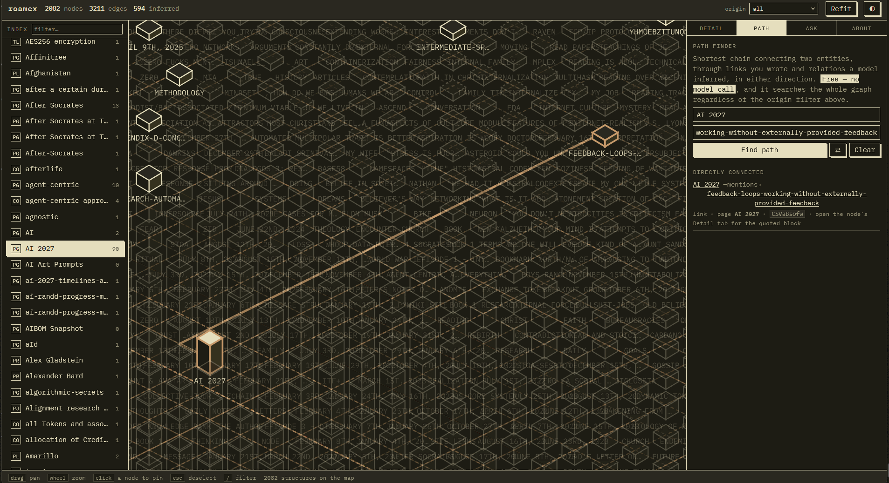

# roamex

Turns your Roam Research graph into a queryable knowledge graph, where every answer cites
the block it came from.

roamex reads your Roam graph directly — pages, blocks, `[[links]]`, `#tags`,
`attribute:: value` — deterministically, no model involved. Then a language model reads the
*prose* inside your blocks and extracts the relations you stated but never linked:

> "Started at Acme in 2019, reporting to Dana."

No `[[Acme]]`, no `[[Dana]]`, so Roam's own graph shows nothing. roamex turns this into
`author --works_at--> Acme` and `author --reports_to--> Dana Whitfield`, attached to your
existing pages, each edge stamped with the block uid that produced it.

```
$ python -m src.cli pull
pulling graph 'your-graph' (depth=20)...
  wrote 1,487 pages to exports/roam.json

$ python -m src.cli query "who wrote the Kestrel parser?"

Dana Whitfield wrote the Kestrel parser. She is the data lead at Rivet Labs,
which builds tooling for Project Halyard.

seeds: Kestrel parser
sufficient: true   triples shown: 14

citations:
  Dana Whitfield --wrote--> Kestrel parser      [page "Dana Whitfield", block blk-008]
  Dana Whitfield --works_at--> Rivet Labs       [page "Project Halyard", block blk-003]
  Rivet Labs --builds_tooling_for--> Project Halyard  [page "Rivet Labs", block blk-009]
```

## Pipeline

| Stage | What it does | Model? |
|---|---|---|
| `pull` | fetch your graph live from Roam's API | no |
| `parse` | pulled graph → base graph from links, tags, attributes | no |
| `extract` | block prose → candidate triples, each quoting its source | yes |
| `resolve` | "Dana" / "D. Whitfield" / "Dana Whitfield" → one entity | yes, only on ambiguity |
| `assemble` | fold triples into the base graph, keep all provenance | no |
| `query` | question → k-hop subgraph → answer with citations | yes |
| `eval` | precision/recall, over-merge rate, provenance coverage | no |

Models run through [OpenRouter](https://openrouter.ai), tiered by stage. Extraction uses a
cheap model — every triple must quote its source or get dropped, so junk is discarded rather
than trusted. Resolution uses a stronger one, because a wrong merge is silent and
unrecoverable.

```bash
python -m src.cli models              # live catalog, cheapest first
python -m src.cli models --match qwen
```

Prices come from OpenRouter at runtime, never hardcoded.

## Quick start

```bash
python -m pip install -r requirements.txt
cp .env.example .env                     # add your OpenRouter key, ROAM_API_TOKEN, ROAM_GRAPH_NAME

python -m src.cli pull                                        # fetches exports/roam.json live
python -m src.cli pages   --export exports/roam.json          # find a page to start on
python -m src.cli parse   --export exports/roam.json --subtree "Project X"
python -m src.cli extract --export exports/roam.json --subtree "Project X" --dry-run
python -m src.cli extract --export exports/roam.json --subtree "Project X"
python -m src.cli resolve
python -m src.cli assemble
python -m src.cli query "what depends on the old parser?"
```

- `ROAM_API_TOKEN` — from your graph's own settings in Roam, under "API tokens".
- `ROAM_GRAPH_NAME` — the graph's name as it appears in its URL.
- No token yet? Skip `pull` and drop a manual export instead (JSON, not Markdown, from your
  graph's menu) at `exports/roam.json` — every other command works unchanged.

`--dry-run` prices an extraction run before you spend anything:

```
375 blocks qualify for extraction
  ~68,134 chars of block text; ~164,033 input tokens with prompts
  model: qwen/qwen3.7-flash   calls: 375
  estimated cost: $0.0122  (in $0.0049 + out $0.0073)
```

Start with `--subtree` on a small page first. At these prices a full graph runs for pocket
change, but a bad prompt is cheaper to catch on 59 blocks than on 4,757 — and a full run
ships your entire knowledge base to a third-party model provider in one go.

Everything except `pull`, `extract`, `resolve`, and `query` runs offline, no key required.

## Viewer

```bash
python web/serve.py          # opens 127.0.0.1:8790
```


A local, read-only viewer served straight from `work/graph.db`.

- **Index** (left) — every entity, filterable by type and sortable by name, connection count,
  or type. Daily notes fold into one collapsible group so they don't drown out everything
  else.
- **Map** (middle) — every entity as an isometric structure. **Height is degree**, so the
  busiest entities stand tallest and sit nearest the centre. **Solid outline = you wrote that
  link by hand** in Roam; **dashed = a model inferred it** from your prose. Drag to pan, wheel
  to zoom.
- **Detail** — what the selected entity says, what refers to it, and every source block
  behind each claim.
- **Path** — shortest chain connecting any two entities, with the connecting edges
  highlighted on the map.
- **Ask** — a grounded question against the whole graph.
- **About** — legend and counts.

### Path — shortest connection between two entities



Pure client-side breadth-first search over the graph already loaded in the page — free,
instant, no model call. Works across the whole graph regardless of the origin filter, and
switches the filter back to "all" if it would otherwise hide the path it found.

### Ask — grounded question answering


The one feature here that costs a model call. Answers are built only from triples in your
graph, and every claim cites the page and block it came from. When the graph doesn't have
enough to answer, it says so — `sufficient: false` — rather than padding the answer with
plausible-sounding filler.

## What it won't do

- **Assert what your notes don't say.** An extracted relation must quote the block it came
  from, verbatim, or it's dropped.
- **Merge two people who share a name without evidence.** A missed merge just leaves a
  duplicate node you can see and fix; an over-merge fuses two entities' facts with no signal
  it happened. Resolution fails closed, and `eval` reports the over-merge rate.
- **Answer without showing its work.** Query reasons over a serialized subgraph and nothing
  else. A cited edge that wasn't actually shown to the model is flagged, not returned clean.

## Privacy

- `exports/`, `work/`, and gold sets are gitignored — nothing derived from your notes is
  committed.
- Block text is sent to whichever model you point OpenRouter at. There's no content filter
  yet; if you need one, it belongs in `blocks_for_extraction`.
- `pull` sends your Roam API token to Roam's own API and nowhere else.

## Testing

```bash
python -m pytest
```

Every test runs offline. Each model-calling stage splits into a `run()` that hits the network
and a `parse_*_response()` that doesn't — tests only exercise the second, against recorded
replies in `fixtures/openrouter/`.

## Status

- Proven end-to-end on real data: a 1,000-block sample from a ~1,500-page graph produced 594
  triples (0 failures), assembled into a 2,082-node / 3,211-edge graph with 100% provenance
  coverage, and queried successfully at that scale.
- `pull` verified against a live graph with 0 block-level mismatches against a manual export.
- The full graph (~4,750 extractable blocks) is priced (~$0.16 at current rates) but not yet
  run end-to-end.
- Two known, unfixed limits at scale: a blocking hub-node artifact in `resolve` (capped, not
  eliminated), and a redundant double graph-load per query (~10% of latency).
- The viewer is confirmed rendering the real 2,082-node graph and is collision-free at full
  scale. One rough edge: structure labels overlap at full-graph zoom — the index or Detail
  panel is the reliable way to read a specific entity at that density.

See `CLAUDE.md` for the full scale write-up.
