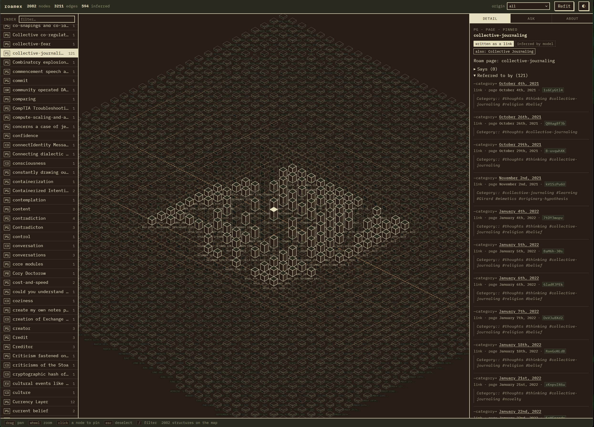

# roamex

Connects to your Roam Research graph over Roam's own API and turns it into a queryable
knowledge graph where every answer cites the block it came from.

Your Roam graph is already a graph: pages, blocks, `[[links]]`, `#tags`, `attribute:: value`.
roamex pulls that structure live and reads it directly and deterministically — no model
involved, because running one over structure the format already states just makes ground
truth fuzzier.

The part worth paying for is the second pass. A language model reads the *prose* inside your
blocks and extracts the relations you stated in a sentence but never linked:

> "Started at Acme in 2019, reporting to Dana."

No `[[Acme]]`, no `[[Dana]]`, so Roam's own graph shows nothing. roamex turns it into
`author --works_at--> Acme` and `author --reports_to--> Dana Whitfield`, attached to the pages
you already keep, each edge stamped with the block uid that produced it.

`pull` fetches your graph live — no browser, no manual export:

```
$ python -m src.cli pull
pulling graph 'your-graph' (depth=20)...
  wrote 1,487 pages to exports/roam.json
```

Then you can ask it things, and check its work:

```
$ python -m src.cli query "who wrote the Kestrel parser?"

Dana Whitfield wrote the Kestrel parser. She is the data lead at Rivet Labs,
which builds tooling for Project Halyard.

seeds: Kestrel parser
sufficient: true   triples shown: 14

citations:
  Dana Whitfield --wrote--> Kestrel parser      [page "Dana Whitfield", block blk-008]
  Dana Whitfield --works_at--> Rivet Labs       [page "Project Halyard", block blk-003]
  Rivet Labs --builds_tooling_for--> Project Halyard  [page "Rivet Labs", block blk-009]
```

## The pipeline

| Stage | What it does | Model? |
|---|---|---|
| `pull` | fetch your graph live from Roam's API | no |
| `parse` | pulled graph → base graph from links, tags, attributes | no |
| `extract` | block prose → candidate triples, each quoting its source | yes |
| `resolve` | "Dana" / "D. Whitfield" / "Dana Whitfield" → one entity | yes, only on ambiguity |
| `assemble` | fold triples into the base graph, keep all provenance | no |
| `query` | question → k-hop subgraph → answer with citations | yes |
| `eval` | precision/recall, over-merge rate, provenance coverage | no |

Models are called through [OpenRouter](https://openrouter.ai), tiered per stage by how
*checkable* each stage is. Extraction runs on a cheap model because every triple it produces
must quote its source block or get dropped — junk is discarded, not believed. Resolution is
the stage to spend on: a wrong merge is silent and unrecoverable.

```bash
python -m src.cli models              # live catalog, cheapest first
python -m src.cli models --match qwen
```

Prices are read from OpenRouter at runtime, never hardcoded here.

## Quick start

```bash
python -m pip install -r requirements.txt
cp .env.example .env                     # add your OpenRouter key, ROAM_API_TOKEN, ROAM_GRAPH_NAME

python -m src.cli pull                                        # fetches exports/roam.json live
python -m src.cli pages   --export exports/roam.json          # find a page to start on
python -m src.cli parse   --export exports/roam.json --subtree "Project X"
python -m src.cli extract --export exports/roam.json --subtree "Project X" --dry-run
python -m src.cli extract --export exports/roam.json --subtree "Project X"
python -m src.cli resolve
python -m src.cli assemble
python -m src.cli query "what depends on the old parser?"
```

`ROAM_API_TOKEN` comes from your graph's own settings in Roam (an "API tokens" section);
`ROAM_GRAPH_NAME` is the graph's name as it appears in its URL. Everything downstream of
`exports/roam.json` — `pages` through `query` — doesn't know or care whether that file came
from `pull` or a manual export, so switching between them later costs nothing.

No token yet, or want to try roamex before setting one up? Skip `pull` and drop Roam's own
export (JSON, not Markdown, from your graph's menu) at `exports/roam.json` instead — same
file, same shape, every other command works unchanged.

`--dry-run` prices an extraction run against the live catalog before you spend anything:

```
375 blocks qualify for extraction
  ~68,134 chars of block text; ~164,033 input tokens with prompts
  model: qwen/qwen3.7-flash   calls: 375
  estimated cost: $0.0122  (in $0.0049 + out $0.0073)
```

Start with `--subtree` anyway. Not for the money — at these prices a 7,000-block graph runs
for pocket change — but because a wrong prompt is cheaper to find on 59 blocks than on 4,757,
and because a full run ships your entire knowledge base to a third-party provider in one go.

Everything except `pull`, `extract`, `resolve` and `query` runs offline with no key.

## The viewer

```bash
python web/serve.py          # 127.0.0.1:8790
```



Read-only, local, and served straight from `work/graph.db`. Three panes:

**Left — the index.** Every entity, alphabetical, with a two-letter type code and its
connection count. Daily notes fold into one collapsible group (they're often a third of a
real graph and say little individually); everything else is listed flat. `/` jumps to the
filter. Codes are `PG` page · `CO` concept · `PR` person · `EV` event · `SR` source ·
`PL` place · `TL` tool · `OR` org · `PJ` project — hover any chip, or open **About**, for
the full legend.

**Middle — the map.** Every entity as an isometric structure. **Height is degree**, so the
busiest entities stand tallest and sit nearest the centre, and the sparse outer field is the
long tail — in the shot above, the faint outer diamond is mostly daily notes with a single
link each. **A solid outline means you wrote that link by hand** in Roam; **dashed means a
model inferred it** from your prose. Edges follow the same rule. Selecting a structure dims
everything it doesn't touch. Drag to pan, wheel to zoom, `esc` to deselect.

**Right — three tabs.** *Detail* is what the selected entity says, what refers to it, and
every source block behind each claim — in the shot, `collective-journaling` is pinned, and
each of its 121 references names the page, the block uid, and the quoted line. Nothing is
asserted without a block you can go read. *Ask* runs a grounded question against the whole
graph and is the only thing here that costs a model call. *About* holds the legend and
counts.

## Three things it refuses to do

**Assert what your notes don't say.** An extracted relation must quote the block it came
from, verbatim. If the model can't quote it, the triple is dropped — that's the line between
"the note says this" and "the model happens to know this," and the second one is
unfalsifiable once it's in the graph.

**Merge two people who share a first name.** A missed merge leaves a duplicate node you can
see and fix. An over-merge fuses two entities' facts with no signal they were ever separate.
Resolution fails closed at every branch, and `eval` reports the over-merge rate.

**Answer without showing its work.** Query reasons over a serialized subgraph and nothing
else. Citations are checked against what the model was actually shown; a cited edge that
wasn't in the prompt is flagged, not returned clean.

## Your notes stay yours

`exports/`, `work/`, and unlabelled gold sets are gitignored — the export (however it got
there — `pull` or manual), the derived graph, the database, all of it. The test fixtures are
synthetic, not redacted real notes.

Block text is sent to whichever model you point OpenRouter at. There's no exclusion filter
yet; if you need one, it belongs in `blocks_for_extraction`. `pull` sends your Roam API token
to Roam's own API and nowhere else.

## Testing

```bash
python -m pytest
```

Every test runs offline. Each LLM stage splits into a `run()` that calls the network and a
`parse_*_response()` that doesn't; tests only exercise the second, against recorded replies
in `fixtures/openrouter/`. `pull` follows the same split — `convert_pulled_pages()` is tested
offline against a fixture, `RoamClient`'s actual HTTP layer isn't — with one difference worth
knowing: that fixture's shape was a documented guess until `pull` ran once for real (see
Status below), not captured from an actual response the way the OpenRouter fixtures were.

## Status

Proven end-to-end against real data, not just the synthetic fixture: a 1,000-block sample
pulled from across a real ~1,500-page graph (594 triples extracted, 0 failures), assembled
into a 2,082-node / 3,211-edge graph with 100% provenance coverage, and queried successfully
at that scale, including the point where retrieval hits its truncation cap. `pull` itself was
verified against a live graph with 0 block-level mismatches against a manual export. The full
graph (~4,750 extractable blocks) has been priced (~$0.16 at current cheap-model rates) but
not yet run end-to-end — see `CLAUDE.md`'s Scale section for exactly what has and hasn't been
measured, and for two known-and-unfixed limitations found running at this scale: a blocking
hub-node artifact in `resolve` (capped, not eliminated) and a redundant double graph-load per
query (measured at ~10% of query latency, not yet the bottleneck).

The viewer in `web/` is built and confirmed rendering against the real 2,082-node graph —
that's the screenshot above. Its JSON layer is tested and the layout is collision-free at
full scale. One known rough edge visible in that shot: at full-graph zoom the structure
labels in the dense centre overlap into noise. Zooming in resolves them, and the index and
detail panel are the reliable way to read a specific entity.
